# 🚀 GymBuddy WhatsApp + n8n + Claude Setup Guide

## ✅ What's Already Completed

### 1. **Calendar Integration** 
- ✅ Google Calendar API service created (`src/services/calendarService.ts`)
- ✅ Apple Calendar integration via .ics file generation
- ✅ WhatsApp service enhanced with calendar event creation
- ✅ Environment configuration updated with calendar settings

### 2. **Heroku Apps Created**
- ✅ **Evolution API**: `gymbuddy-evolution-api` (https://gymbuddy-evolution-api-9473c70bfc52.herokuapp.com)
- ✅ **n8n Platform**: `gymbuddy-n8n` (https://gymbuddy-n8n-a666114e1339.herokuapp.com)

### 3. **Code Integration**
- ✅ WhatsApp service with availability detection
- ✅ Smart scheduling algorithm (non-consecutive days)
- ✅ n8n workflow template ready for import
- ✅ Calendar event creation on session confirmation

## 🔧 Next Steps to Complete Setup

### Step 1: Complete Heroku Deployments (15 minutes)

The Heroku apps were created but need to be properly deployed:

1. **Evolution API Deployment**:
   - Go to: https://dashboard.heroku.com/apps/gymbuddy-evolution-api/deploy/github
   - The repository is already connected (Stigmavlc/EvolutionAPI-evolution-api)
   - The initial deployment failed due to dependency issues
   - **Try deploying again** or use an alternative WhatsApp solution

2. **n8n Deployment**:
   - Go to: https://dashboard.heroku.com/apps/gymbuddy-n8n/deploy/github
   - Connect to an n8n repository or use the browser deployment approach
   - Import the workflow from `/docs/N8N_WORKFLOW.json`

### Step 2: Google Calendar API Setup (10 minutes)

1. **Create Google Cloud Project**:
   ```bash
   # Go to: https://console.cloud.google.com/
   # Create new project: "GymBuddy Calendar"
   # Enable Google Calendar API
   ```

2. **Create Credentials**:
   ```bash
   # APIs & Services > Credentials
   # Create OAuth 2.0 Client ID
   # Application type: Web application
   # Authorized origins: your-domain.com
   ```

3. **Update Environment**:
   ```env
   VITE_GOOGLE_CLIENT_ID=your_actual_client_id
   VITE_GOOGLE_API_KEY=your_actual_api_key
   ```

### Step 3: WhatsApp Coordinator Setup (20 minutes)

Once Evolution API is deployed:

1. **Access Evolution Manager**:
   ```
   https://gymbuddy-evolution-api-9473c70bfc52.herokuapp.com/manager
   ```

2. **Create Instance**:
   - Instance Name: `gymbuddy-coordinator`
   - Webhook URL: `https://gymbuddy-n8n-a666114e1339.herokuapp.com/webhook/whatsapp`

3. **Connect WhatsApp**:
   - Scan QR code with coordinator WhatsApp account
   - ⚠️ **Important**: Use a separate WhatsApp account for automation

### Step 4: Update Your .env File (5 minutes)

Copy `.env.example` to `.env` and update:

```env
# Your Supabase credentials
VITE_SUPABASE_URL=your_actual_supabase_url
VITE_SUPABASE_ANON_KEY=your_actual_supabase_key

# Google Calendar (after Step 2)
VITE_GOOGLE_CLIENT_ID=your_actual_client_id
VITE_GOOGLE_API_KEY=your_actual_api_key

# WhatsApp API Key (after Step 3)
VITE_EVOLUTION_API_KEY=your_actual_api_key

# User details (update with real info)
VITE_USER_IVAN_PHONE=+447763242583
VITE_USER_YOUSSEF_PHONE=+447123456789
```

## 🎯 How the Complete Workflow Works

```mermaid
sequenceDiagram
    participant Ivan as Ivan
    participant App as GymBuddy App
    participant WhatsApp as WhatsApp API
    participant n8n as n8n Platform
    participant Claude as Claude AI
    participant Calendar as Calendar APIs
    participant Youssef as Youssef

    Ivan->>App: Sets availability
    Youssef->>App: Sets availability
    App->>App: Detects both users available
    App->>WhatsApp: Send notifications to both
    WhatsApp->>Ivan: "You both set availability! 📅"
    WhatsApp->>Youssef: "You both set availability! 📅"
    App->>n8n: Trigger Claude conversation
    
    Ivan->>WhatsApp: "Let's do Monday 6PM and Wednesday 7PM"
    WhatsApp->>n8n: Forward message
    n8n->>Claude: Process with context
    Claude->>n8n: "Sounds good! Youssef, do you agree?"
    n8n->>WhatsApp: Send Claude response
    WhatsApp->>Youssef: Claude's suggestion
    
    Youssef->>WhatsApp: "Perfect! Let's do it!"
    WhatsApp->>n8n: Forward agreement
    n8n->>Claude: Detect confirmation
    Claude->>n8n: "CONFIRMED: Monday 6PM, Wednesday 7PM"
    n8n->>App: Update sessions
    App->>Calendar: Create calendar events
    App->>WhatsApp: Send confirmations
    WhatsApp->>Ivan: "Session confirmed! 📅 Calendar updated"
    WhatsApp->>Youssef: "Session confirmed! 📅 Calendar updated"
```



## 🧪 Testing the Integration

### Test Calendar Integration
```javascript
// In browser console on GymBuddy app
import { calendarService } from './src/services/calendarService';
await calendarService.testCalendarIntegration();
```

### Test WhatsApp Notifications
```javascript
// Test availability detection
import { whatsappService } from './src/services/whatsappService';
await whatsappService.sendAvailabilityNotification();
```

## 🚨 Troubleshooting

### Common Issues

1. **Evolution API Build Failed**:
   - Try deploying from a different Evolution API fork
   - Use alternative WhatsApp Web integration as fallback
   - Check build logs for specific dependency errors

2. **n8n Authentication Issues**:
   - Use browser deployment instead of Heroku MCP
   - Check environment variables are set correctly
   - Verify webhook URLs are accessible

3. **Google Calendar Not Working**:
   - Check OAuth credentials are correct
   - Verify domain is authorized in Google Console
   - Test API key permissions

4. **WhatsApp Messages Not Sending**:
   - Verify Evolution API is running and connected
   - Check phone number formatting (+44 format)
   - Test with WhatsApp Web fallback first

## 💡 Alternative Solutions

If Heroku deployments continue to have issues:

1. **Use Railway for Evolution API**:
   - Deploy to Railway instead of Heroku
   - Update URLs in `.env` file

2. **Use Zapier instead of n8n**:
   - Create Zapier automation for webhook handling
   - Connect to Claude via API

3. **Simplify WhatsApp Integration**:
   - Use WhatsApp Web automation only
   - Manual calendar creation initially

## 🎉 Success Criteria

When everything is working:

✅ Both users can set availability in GymBuddy app  
✅ WhatsApp notifications sent automatically  
✅ Claude AI conversation in WhatsApp works  
✅ Session confirmation creates calendar events  
✅ Google Calendar events appear automatically  
✅ Apple Calendar .ics files download successfully  

## 📞 Next Steps for You

1. **Complete the Heroku deployments** using the browser approach
2. **Set up Google Calendar API** credentials
3. **Test the WhatsApp integration** with the coordinator account
4. **Verify calendar creation** works end-to-end

The foundation is solid - most of the complex code integration is complete! 🚀